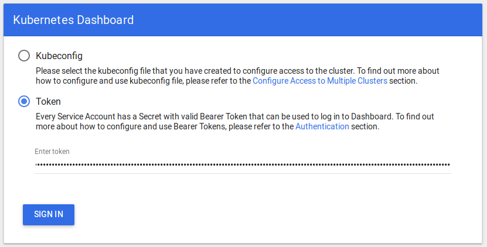
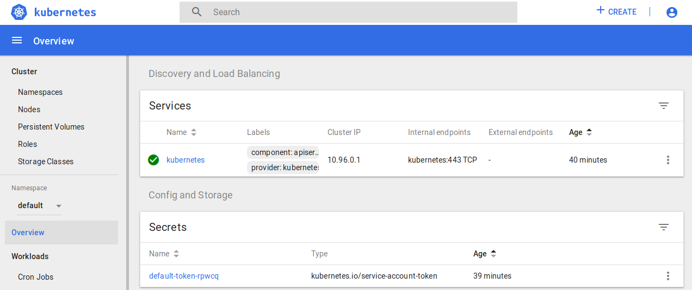
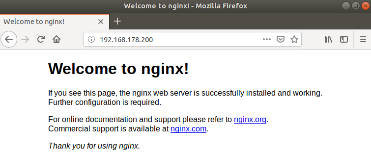
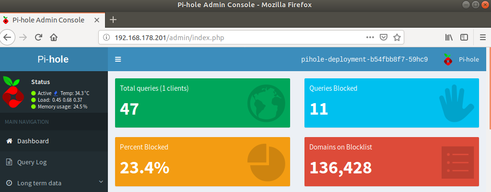

# Kubernetes
I'll perform the next steps manually and will later create Ansible playbooks. I will use Flannel as pod network add-on and MetalLB as load-balancer.

## Initialize master
SSH into the master.
```
ssh pi@192.168.178.10
```

Pull images for kubeadm. This might take a couple of minutes.
```
sudo kubeadm config images pull
```

Initialize master. The `--pod-network-cidr=10.244.0.0/16` paramater is mandatory for Flannel.
```
sudo kubeadm init --token-ttl=0 --pod-network-cidr=10.244.0.0/16
```

As described in the output, run the following commands as the regular Pi user.
```
mkdir -p $HOME/.kube
sudo cp -i /etc/kubernetes/admin.conf $HOME/.kube/config
sudo chown $(id -u):$(id -g) $HOME/.kube/config
```

Save the join command for use on the cluster nodes.
```
kubeadm join 192.168.178.10:6443 --token ia7kv4.b1ll2jfk2px14fsm --discovery-token-ca-cert-hash sha256:364ba409f94f328b069c62c2820e6448e685915cbb5a43c226076285f9e5b17c
```

Check pods.
```
kubectl get pods --all-namespaces
```

Install Flannel.
```
kubectl apply -f https://raw.githubusercontent.com/coreos/flannel/master/Documentation/kube-flannel.yml
```

## Join nodes
SSH into node 1 and 2.
```
ssh pi@192.168.178.11
ssh pi@192.168.178.12
```

Join the cluster.
```
sudo kubeadm join 192.168.178.10:6443 --token a2zday.lvpn6yad18ktq8u2 --discovery-token-ca-cert-hash sha256:36e4f87d2ce16000298b63d41e379da32dcd19abc2f7c9ed6a6201bc024fc885
```

Verfiy the correct status.
```
kubectl get nodes

NAME       STATUS   ROLES    AGE   VERSION
kubepi01   Ready    master   14m   v1.11.6
kubepi02   Ready    <none>   92s   v1.11.6
kubepi03   Ready    <none>   70s   v1.11.6
```

## Configure Admin VM to access the cluster
Create `.kube` folder in home dir on Admin VM and copy the kubeconfig from master to Admin VM.
```
mkdir ~/.kube
scp pi@192.168.178.10:/home/pi/.kube/config ~/.kube/config
```

Install kubectl on Admin VM.
```
sudo snap install kubectl --classic
```

Verfiy connectivity to cluster.
```
kubectl get pods --all-namespaces
kubectl get nodes
```

## Install Dashboard
Deploy dashboard.
```
kubectl apply -f https://raw.githubusercontent.com/kubernetes/dashboard/v1.10.1/src/deploy/recommended/kubernetes-dashboard-arm.yaml
```

Verify with `kubectl get pods --all-namespaces` that the pod `kubernetes-dashboard` is running.

Create admin user and role binding for dashboard user.
```
kubectl create -f admin-user.yaml
```

Retreive authentication token for admin-user.
```
kubectl -n kube-system describe secret $(kubectl -n kube-system get secret | grep admin-user | awk '{print $1}')
```

Start the kubectl proxy.
```
kubectl proxy
```

Open the Dashboard URL [http://localhost:8001/api/v1/namespaces/kube-system/services/https:kubernetes-dashboard:/proxy/] and log in with the token from the admin-user.





## Helm
Install Helm on Admin VM and initalize it. Use a specific Tiller image for ARM and a dedicated service account. [https://github.com/jessestuart/tiller-multiarch]

```
sudo snap install helm --classic
kubectl create -f tiller-rbac.yaml
helm init --tiller-image=jessestuart/tiller:v2.9.1 --service-account tiller
```

## Storage
Shared storage is provided by an NFS share on a Synology NAS with IP `192.168.178.30` and path `/volume1/kube-data/pv`.

### Manual Persistent Volumes on NFS Share
Create a subfolder on the NFS share named `pv0001`.

Create a persistent volume with 10 Mb and verfify.
```
kubectl create -f pv0001.yaml
kubectl get pv
```

Create a test pod with a persistent volume claim and verify.
```
kubectl create -f pod0001.yaml
kubectl get pvc,pv,pods
kubectl describe pod pod0001
```

Check the folder `pv0001` to see if a file named `SUCCESS` has been created.

### Install NFS Client Provisioner via Helm for Dynamic Volume Provisioning
Install NFS Client Provisioner and set parameters for NFS server and path, as well as the ARM image to use.
```
helm install --name nfs-prov --set nfs.server=192.168.178.30 --set nfs.path=/volume1/kube-data/pv --set image.repository=quay.io/external_storage/nfs-client-provisioner-arm stable/nfs-client-provisioner
```

Create a test pod with a persitent volume claim and verify.
```
kubectl create -f pod0002.yaml
kubectl get pvc,pv,pods
kubectl describe pod pod0002
```

Check the NFS share folder to see if a subfolder with the name `default-pvc0002-pvc-*` has been created and that it contains a file named `SUCCESS`.

## Networking
I'm using MetalLB as load-balancer to provide IP's from within my private network range for the services. In my case this is a `192.168.178.0/24` network, the IP range for the load-balancer is `192.168.178.200-192.168.178.250`. This range is not served by my routers DHCP.

[Read more about MetalLB](https://metallb.universe.tf/#why) and about [Kubernetes service types](https://kubernetes.io/docs/concepts/services-networking/service/#publishing-services-service-types).

### Load Balancer - MetalLB
Install with Helm.
```
helm install --name metallb stable/metallb
```

Modify the IP address range in `metallb-configmap.yaml` and create the configmap afterwards.
```
kubectl create -f metallb-configmap.yaml
```

Deploy an nginx service and pod for testing.
```
kubectl create -f nginx-test.yaml
```

Check if `service/nginx-test` has an external IP address assigned to it and that `pod/nginx-test` is running.
```
kubectl get svc,pods nginx-test
NAME                 TYPE           CLUSTER-IP      EXTERNAL-IP       PORT(S)        AGE
service/nginx-test   LoadBalancer   10.100.149.92   192.168.178.200   80:30473/TCP   36m

NAME             READY   STATUS    RESTARTS   AGE
pod/nginx-test   1/1     Running   0          36m

```

Open the external IP in your browser.



Delete service and pod.
```
kubectl delete -f nginx-test.yaml
```

### NodePort Service
This is just an example of a `NodePort` service. I'm using the same nginx test pod specification, but change the service type to `NodePort` and specify a particular portnumber of `31000`. 
```
kubectl create -f nginx-nodeport.yaml
```

Verify.
```
kubectl get svc,pods --selector=app=nginx-nodeport-test-app
NAME                             TYPE       CLUSTER-IP     EXTERNAL-IP   PORT(S)        AGE
service/nginx-nodeport-service   NodePort   10.99.167.90   <none>        80:31000/TCP   1m

NAME                     READY   STATUS    RESTARTS   AGE
pod/nginx-nodeport-pod   1/1     Running   0          1m
```

Open with the master or any other nodes IP and port 31000, e.g. `http://192.168.178.10:31000`.


Delete service and pod.
```
kubectl delete -f nginx-nodeport.yaml
```


## Deploy Workloads
One of my goals was to get [Pi-hole](https://pi-hole.net/) up an running on my cluster, since I have it already running on a single Rasperry Docker host. More workloads should follow, like MySQL/MariaDB for hosting a Kodi database.

### Pi-hole
Deploy Pi-hole.
```
kubectl create -f pihole.yaml
```
The `pihole.yaml` contains two services, one persistent volume claim and one deployment to run one instance of a pihole container.

Just a short explanation:
* Since load-balancers do not support support mixed protocols, I have to deploy two services, one for TCP and one for UDP. These services are requesting a specific IP and share them via `metallb.universe.tf/allow-shared-ip`. The parameter `externalTrafficPolicy` has to be set to `Local` so that the container will see the clients real IP address and serve it properly.
* The persistent volume claim requests a 1 GB volume on the NFS share.
* The Pi-hole container needs a couple of environment variabales and two volumes mounts. Both point to the same persistent volume, but in different subfolders.

Verfiy.
```
kubectl get svc,pods,pvc --selector=app=pihole-app
NAME                         TYPE           CLUSTER-IP      EXTERNAL-IP       PORT(S)                                   AGE
service/pihole-service-tcp   LoadBalancer   10.103.55.195   192.168.178.201   80:30896/TCP,443:31346/TCP,53:31580/TCP   30m
service/pihole-service-udp   LoadBalancer   10.103.45.163   192.168.178.201   53:31388/UDP                              30m

NAME                                    READY   STATUS    RESTARTS   AGE
pod/pihole-deployment-b54fbb8f7-59hc9   1/1     Running   1          30m

NAME                                      STATUS   VOLUME                                     CAPACITY   ACCESS MODES   STORAGECLASS   AGE
persistentvolumeclaim/pihole-pvc-config   Bound    pvc-7cf14759-1136-11e9-8467-b827ebe1339e   1Gi        RWO            nfs-client     30m
```

Inspect logs.
```
kubectl logs pod/pihole-deployment-b54fbb8f7-59hc9 -f
```

Open Pi-hole with external IP in Browser.



I pointed a Windows client on my network to use this Pi-hole instance for DNS lookups and it worked instantly.
```
PS C:\> Resolve-DnsName -Name www.heise.de -Type A

Name                                           Type   TTL   Section    IPAddress
----                                           ----   ---   -------    ---------
www.heise.de                                   A      12121 Answer     193.99.144.85
```

Pi-hole Log:
```
dnsmasq: query[A] www.heise.de from 192.168.178.31
dnsmasq: cached www.heise.de is 193.99.144.85
```

## Collection of kubectl Commands
```
# Run interactive busybox container
kubectl run -i --tty busybox --image=busybox --restart=Never -- sh
```

## Resources
* [https://kubernetes.io/docs/setup/independent/create-cluster-kubeadm/]
* [https://kubernetes.io/docs/reference/kubectl/cheatsheet/]
* [https://github.com/kubernetes/dashboard/wiki/Installation]
* [https://github.com/kubernetes/dashboard/wiki/Access-control#admin-privileges]
* [https://github.com/kubernetes/dashboard/wiki/Creating-sample-user]
* [https://docs.helm.sh/using_helm/#quickstart-guide]
* [https://metallb.universe.tf]
