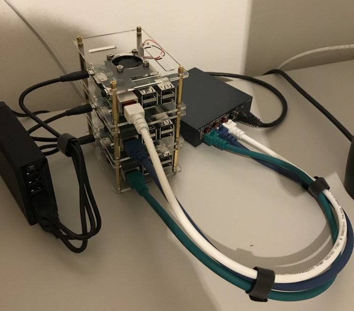

# KubePi
This repo is currently considered to be a dumping ground for all the things I want to try out with my Raspberry Pi cluster which ultimately should run Kubernetes and a couple of containers at home. Besides that I want to try out a couple of other things like Ansible and stuff.

I did not come up with all this by my one. Please refer to repos listed under resources.

## Admin Machine
* Ubuntu 18 VM
* APT Packages
  * open-vm-tools-desktop, curl, git
* Additional Tools
  * Visual Studio Code [https://code.visualstudio.com/docs/setup/linux#_installation]
  * PowerShell Core [https://docs.microsoft.com/en-us/powershell/scripting/install/installing-powershell-core-on-linux?view=powershell-6#installation-via-package-repository---ubuntu-1804]

## Generate SSH key for GitHub an Ansible

Generate SSH key [https://help.github.com/articles/generating-a-new-ssh-key-and-adding-it-to-the-ssh-agent/] and add the public key to the account. The key will later be used for Ansible.

Generate SSH key with `ssh-keygen -t rsa -b 4096 -C "my@mail.com"`.

## Continue with
[Raspbian Setup](https://github.com/vzovko/KubePi/tree/master/Raspbian)

## To Do
* Kubernetes
* Pihole Container
* Logging & Monitoring (Fluentd, Elk, Prometheus, Grafana?)

## Resources
* [https://github.com/alexellis/k8s-on-raspbian]
* [https://github.com/rak8s/rak8s]

